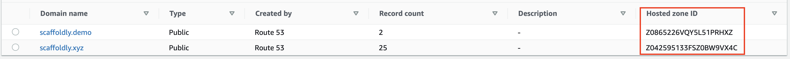

# Alternate Domain for Non-Live

Scaffoldly supports having a secondary domain for Non-Live, for example if you've purchased `my-project.com` and `my-project.dev`.

## Bootstrap Configuration

If you want this configuration, update `main.tf` in `scaffoldly-bootstrap`:


Changing this after initial bootstrapping isn't supported at this time.  
  
[Join the community](https://join.slack.com/t/scaffoldly/signup) to discuss further.


```text
module "bootstrap" {
  source  = "scaffoldly/bootstrap/scaffoldly"
  
  # ... other config
  stages = {
    nonlive = {
      domain = "my-project.dev"
    }
    live = {
      domain = "my-project.com"
    }
  }
}
```

## AWS Route53

Create a second Hosted Zone in Route53. Make note of the different Hosted Zone IDs.



## AWS IAM User

Add the Hosted Zone ID to the Inline Policy for the Bootstrap user in IAM.

```text
{
    "Version": "2012-10-17",
    "Statement": [
        # ... other config ...
        {
            "Effect": "Allow",
            "Action": [
                "sts:AssumeRole",
                "route53:ChangeResourceRecordSets"
            ],
            "Resource": [
                # ... other resources ...
                "arn:aws:route53:::hostedzone/Z0865226VQY5L51PRHXZ"
            ]
        }
    ]
}
```

