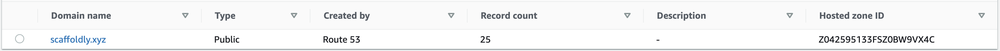

# One Time Setup



## Prerequisites

### Dedicated Project Email Address

1. 🗒️ Create a new email address for your project \(for example **my.project@gmail.com**\) \([Why?](../faqs.md#why-do-i-need-a-dedicated-email-for-my-project)\)
   1. It must NOT be the same as the email address of your root AWS account
   2. It must NOT have been used previously at for any other AWS account

### Domain

1. Purchase a domain for your project \(for example **my-project.tld**\)
   1. [Want a separate domain for Non-Live?](../infrastructure/alternate-domain-for-non-live.md)
2. Make sure it hasn't been used for anything \([Why?](../infrastructure/using-an-existing-domain.md)\)

### GitHub Organization

1. Create a new [GitHub Organization](https://github.com/account/organizations/new)
   1. Name: something that represents your project, e.g. **`my-project`**
   2. ✅ The Free Tier will work fine, paid tiers are also supported.
2. Use the [Dedicated Project Email Address](one-time-setup.md#dedicated-email) you created \(**my.project@gmail.com**\)

### AWS Account

#### Signup

1. If you don't already have an AWS Account, [create one](https://aws.amazon.com). 
   1. ℹ️ If you already have one, you can use that. Scaffoldly will create a [Sub-Account \(aka Organization\)](https://aws.amazon.com/organizations/) to keep projects separate.
   2. ⚠️ Do NOT use your project's email address \([Why?](../faqs.md#why-do-i-need-a-dedicated-email-for-my-project)\)  \(e.g. _something.else.entirely@gmail.com_\)

#### Route 53

1. [Create a Hosted Zone](https://docs.aws.amazon.com/Route53/latest/DeveloperGuide/CreatingHostedZone.html) for your project domain
   1. [Have a separate domain for Non-Live?](../infrastructure/alternate-domain-for-non-live.md)
2. 🗒️ Make note of the **Hosted Zone ID**
3. [Update the NS records](https://docs.aws.amazon.com/Route53/latest/DeveloperGuide/MigratingDNS.html) at your domain's registrar to point to Route 53



#### **AWS Organizations**

1. Ensure you have [enabled AWS Organizations](https://aws.amazon.com/premiumsupport/knowledge-center/get-started-organizations/) on your root AWS account

#### IAM User


1. [Create a new AWS IAM](https://docs.aws.amazon.com/IAM/latest/UserGuide/id_users_create.html#id_users_create_console) user
   1. Enable **Programmatic Access**
   2. **❓**The user name is unimportant to us, you can use `scaffoldly-bootstrap`  
   3. 🗒️ ****Download the Access Key and Secret Key CSV
2. Go to the new user and on the Permissions tab
3. Add an Inline Policy \(update the **Hosted Zone ID** with your Hosted Zone ID\)

   `{  
     "Version": "2012-10-17",  
     "Statement": [  
       {  
         "Effect": "Allow",  
         "Action": [  
           "organizations:*",  
           "route53:List*",  
           "route53:Get*"  
         ],  
         "Resource": "*"  
       },  
       {  
         "Effect": "Allow",  
         "Action": [  
           "sts:AssumeRole",  
           "route53:ChangeResourceRecordSets"  
         ],  
         "Resource": [  
           "arn:aws:iam::*:role/ScaffoldlyBootstrap",  
           "arn:aws:route53:::hostedzone/YOUR-HOSTED-ZONE-ID"  
         ]  
       }  
     ]  
   }`

#### Terraform Cloud

1. Create a [Terraform Cloud](https://app.terraform.io/signup/account) account
   1. ⚠️ Username: Same as your [GitHub Organization](one-time-setup.md#github-organization), e.g. **my-project**
   2. ⚠️ Email: The [Dedicated Project Email Address](one-time-setup.md#dedicated-project-email-address) you created earlier \(e.g. **my.project@gmail.com**\)
2. 🗒️ Create and make note of an [API Token](https://app.terraform.io/app/settings/tokens)
   1. **❓**The name is unimportant to us, you can use `scaffoldly-bootstrap` 

## Add Scaffoldly Bootstrap Template 🙌 

1. Add the [Scaffoldly Bootstrap](https://github.com/scaffoldly/bootstrap-template/generate) repository into to the GitHub organization you [created](../getting-started/prerequisites.md)
   1. ⚠️ Name it `scaffoldly-bootstrap`
   2. Keep it **Private**

### GitHub Token

1. 🗒Create a [**GitHub Token**](https://github.com/settings/tokens/new)
   1. 1. [x] `repo`
      2. [x] `workflow`
      3. [x] `admin:org`
         1. [x] `org:read`
         2. [x] `org:write`

### **Add Secrets**

1. Go to **Settings** &gt; **Secrets** for `scaffoldly-bootstrap` in your organization
2. Add five new **Repository** **Secrets**
   1. `BOOTSTRAP_ROOT_EMAIL`: The [Dedicated Project Email Address](one-time-setup.md#dedicated-project-email-address) you created earlier \(e.g. **my.project@gmail.com**\)
   2. `BOOTSTRAP_AWS_ACCESS_KEY_ID`: The [AWS Access Key](one-time-setup.md#iam-user) in the CSV you downloaded
   3. `BOOTSTRAP_AWS_SECRET_ACCESS_KEY`: The AWS Secret Key in the CSV you downloaded
   4. `BOOTSTRAP_GITHUB_TOKEN`: The [GitHub Access Token](one-time-setup.md#github-token) you created
   5. `BOOTSTRAP_TERRAFORM_TOKEN`: The [Terraform API Key](one-time-setup.md#terraform-cloud) you created
3. You can now dispose of copies you made of these secrets, you won't need them again.

## Create Infrastructure

### Set Domain

1. Edit `main.tf` in `scaffoldly-bootstrap`
2. Set your domain in the `stages` block \([example](https://github.com/scaffoldly-demo/scaffoldly-bootstrap/blob/76206b8a41af9e2a58c0eba3c987f3f65ab46ea3/main.tf#L20-L28)\)
   1. [Have a separate domain for Non-Live?](../infrastructure/alternate-domain-for-non-live.md)

```text
module "bootstrap" {
  source  = "scaffoldly/bootstrap/scaffoldly"
  # ... other configuration ...
  stages = {
    nonlive = {
      domain = "my-project.tld"
      subdomain_suffix = "dev"
    }
    live = {
      domain = "my-project.tld"
    }
  }
}
```

### Commit and Preview Changes

1. Commit \(and push\) your change
2. Go to Actions \(tab\) for the `scaffoldly-bootstrap` project
   1. ❓Here you can watch [Terraform Plan](https://www.terraform.io/docs/cli/commands/plan.html) command execute within GitHub Actions
3. Once finished, go to **Releases** and locate the most recent draft release
   1. Review the release notes \(which is the output from Terraform Plan\) to see what will be added
   2. [❓What's being added?](https://github.com/scaffoldly/terraform-scaffoldly-bootstrap/blob/main/README.md)

### Release

1. [On the Release](one-time-setup.md#commit-and-preview-changes), click **Edit**
2. Then click **Publish**
3. Go to Actions \(tab\) for the `scaffoldly-bootstrap` project
   1. ❓Here you can watch [Terraform Apply](https://www.terraform.io/docs/cli/commands/apply.html) command execute within GitHub Actions

### Verification Emails from SES ⚠️


1. Check the inbox of your [Dedicated Project Email Address](one-time-setup.md#dedicated-project-email-address) for **2 Verification Emails** \(**my.project@gmail.com**\)
2. Click on the links so SES can send email to these
   1. [What about other email addresses?](../faqs.md#ses-cant-send-email-why)

## Verification

1. After Releasing, you will see a new repository in your GitHub Organization named `sly-auth-api`
   1. [What is the `sly-auth-api`?](../serverless-apis/centralized-authentication.md)
2. Go to Actions \(tab\) for `sly-auth-api` and you will see the first deployment in progress.
3. After it finishes, in a browser, navigate to `https://sly-dev`**`.my-domain.tld`**`/auth/jwt.html` and you can test creation of a JWT token


👏 Congratulations! Your infrastructure is now secured, configured and ready to use in AWS!

## What's Next?




